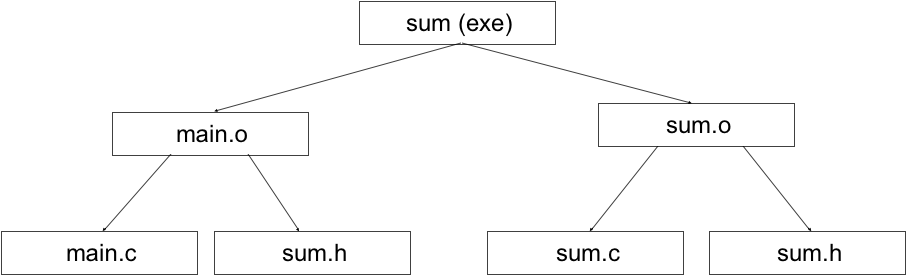
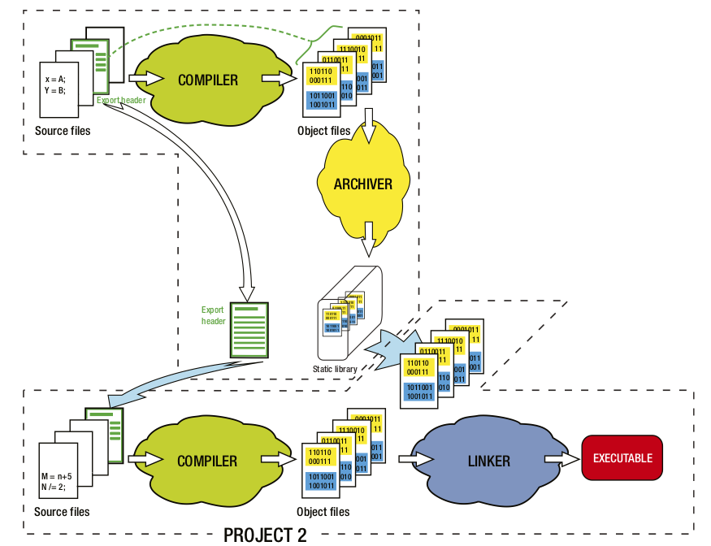
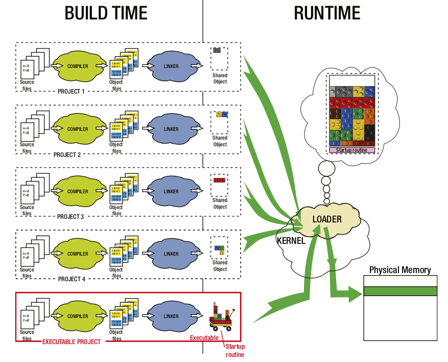

# 大程序组织

* 多文件编译链接
* Makefile
* 库的发布和使用
* 版本和工程管理

---

# 多文件编译链接

* 编译和链接的过程
* 如何调用函数
* 如何访问全局变量
* 静态本地变量
* 头文件的作用和规则
* weak修饰符

---

# 编译和链接的过程

* 在IDE里点击“构建”按钮，背后发生的是什么
* 从外部来看，构建的过程是由：
	* 编译预处理
	* 编译成汇编代码
	* 汇编成目标代码
	* 链接成可执行程序
* 这样四个步骤组成的

---

# 编译过程

* 在命令行编译的时候加上选项`--save-temps`
	* `gcc a.c --save-temps`
* 就能保留编译链接过程中所产生的中间过程文件
	* 编译预处理 --> .i
	* 编译成汇编代码 --> .s
	* 汇编成目标代码 --> .o
	* 链接成可执行程序 --> .exe（或a.out）
* 这些文件都可以再用gcc单独操作，产生下一步结果（但是选项复杂）
* `gcc -c`的选项可以只编译，产生目标文件，但是不链接

---

# 多个.c文件

* main()里的代码太长了适合分成几个函数
* 一个源代码文件太长了适合分成几个文件
* 两个独立的源代码文件不能独立编译形成可执行的程序

---

# 工程项目

* 在Eclipse中新建一个项目，然后把几个源代码文件加入进去
* 对于项目，Eclipse的编译会把一个项目中所有的源代码文件都编译后，链接起来
* 有的IDE有分开的编译和构建两个按钮，前者是对单个源代码文件编译（就是`gcc -c`选项，后者是对整个项目做编译和链接

---

# 编译单元

* 一个项目中的多个.c文件之间一定存在相互调用的关系
	* 如a.c里的f()调用了b.c里的g()
* 一个.c文件是一个编译单元
* 编译器每次编译只处理一个编译单元
	* 编译器不会打开其他文件来参考、检查
	* 即使这些文件在一个项目中，编译器也不看
* 因此需要通过头文件来告诉某个编译单元别的单元里有什么

---

# 头文件

---

# 函数原型

* 如果不给出函数原型，编译器会猜测你所调用的函数的所有参数都是int，返回类型也是int
* 编译器在编译的时候只看当前的一个编译单元，它不会去看同一个项目中的其他编译单元以找出那个函数的原型
* 如果你的函数并非如此，程序链接的时候不会出错
	* 因为汇编函数没有参数表，链接的时候只核对名称不核对参数类型
* 但是执行的时候就不对了
* 所以需要在调用函数的地方给出函数的原型，以告诉编译器那个函数究竟长什么样
（举例）

---

# 头文件

* 把函数原型放到一个头文件（以.h结尾）中，在需要调用这个函数的源代码文件（.c文件）中#include这个头文件，就能让编译器在编译的时候知道函数的原型

---

# #include

* #include是一个编译预处理指令，和宏一样，在编译之前就处理了
* 它把那个文件的全部文本内容原封不动地插入到它所在的地方
	* 所以也不是一定要在.c文件的最前面#include

（用`--save-temps`选项来演示`#include`）

---

# “”还是<>

* #include有两种形式来指出要插入的文件
	* “”要求编译器首先在当前目录（.c文件所在的目录）寻找这个文件，如果没有，到编译器指定的目录去找
	* <>让编译器只在指定的目录去找
* 编译器自己知道自己的标准库的头文件在哪里
* 环境变量和编译器命令行参数也可以指定寻找头文件的目录
	* 环境变量`INCLUDE`，编译选项`-i`
（举例）

---

# #include的误区

* #include不是用来引入库的
* stdio.h里只有printf的原型，printf的代码在另外的地方，某个.lib(Windows)或.a(Unix)中
	* 看一下stdio.h的内容
* 现在的C语言编译器默认会引入所有的标准库
* #include <stdio.h>只是为了让编译器知道printf函数的原型，保证你调用时给出的参数值是正确的类型

---

# 头文件

* 在使用和定义这个函数的地方都应该#include这个头文件
	* 以避免头文件中声明的函数原型和实际定义的不一致
* 一般的做法就是任何.c都有对应的同名的.h，把所有对外公开的函数的原型和全局变量的声明都放进去

---

# 不对外公开的函数

* 在函数前面加上static就使得它成为只能在所在的编译单元中被使用的函数
* 在全局变量前面加上static就使得它成为只能在所在的编译单元中被使用的全局变量

---

# 声明

* 只有声明可以被放在头文件中

---

# 变量的声明

* `int i;`是变量的定义
* `extern int i;`是变量的声明

---

# 声明和定义

* 声明是不产生代码的东西
  * 函数原型
  * 变量声明
  * 结构声明
  * 宏声明
  * 枚举声明
  * 类型声明
  * inline函数
* 定义是产生代码的东西

---

# 头文件

* 只有声明可以被放在头文件中
	* 是规则不是法律
* 否则会造成一个项目中多个编译单元里有重名的实体
* ＊某些编译器允许几个编译单元中存在同名的函数，或者用weak修饰符来强调这种存在

---

# 重复声明

* 同一个编译单元里，同名的结构不能被重复声明
* 如果你的头文件里有结构的声明，很难这个头文件不会在一个编译单元里被`#include`多次
* 所以需要“标准头文件结构”

---

# 标准头文件结构

```
#ifndef _LIST_H_
#define _LIST_H_

typedef struct {
    Node *head;
    Node *tail;
} List;

#endif
```
* 运用条件编译和宏，保证这个头文件在一个编译单元中只会被`#include`一次
* `#pragma once`也能起到相同的作用，但是不是所有的编译器都支持
（举例演示）

---

# 在头文件中引用其他头文件

* 如果在node.h里声明了Node，那么在list.h里，因为用到了Node，一般就要`#include "node.h"`

```
#ifndef _LIST_H_
#define _LIST_H_

#include "node.h"

typedef struct {
    Node *head;
    Node *tail;
} List;

#endif
```

* 这样会造成复杂的依赖关系，即list.h依赖于node.h，一旦node.h修改了，所有`#include`了list.h的编译单元都需要重新编译
* 一般尽量避免在头文件中引用其他头文件，除非必须

---

# 前向声明

```
#ifndef _LIST_H_
#define _LIST_H_

struct Node;

typedef struct {
    Node *head;
    Node *tail;
} List;

#endif
```

* 因为在这个地方不需要具体知道Node是怎样的（占据多大的内存，有哪些成员），只需要知道List里有两个指向Node的指针，所以可以用struct Node来告诉编译器Node是一个结构
* 这样，实际使用List的函数的代码就可以只`#include` list.h，而不需要`#include` node.h

---

# 强符号和弱符号

* 函数和有初始化的全局变量（包括显式初始化为0的）是强符号，无初始化的全局变量是弱符号

* 强符号和弱符号有三条规则：
	* 同名的强符号只能有一个，否则编译器报"重复定义"错误
	* 允许同名的一个强符号和多个弱符号，但链接会选择强符号的
	* 当有多个相同的弱符号时，链接器选择占用内存空间最大的那个

---

# 强符号

* 在编程中经常碰到符号重复定义的情况。如果多个目标文件中含有相同名字全局符号的定义，那么这些目标文件链接的时候将会出现符号重复定义的错误。比如我们在目标文件A和目标文件B都定义了一个全局整形变量global，并将它们都初始化，那么链接器将A和B进行链接时会报错
	* `multiple definition of 'global'`
（举例）

---

# 弱符号

```
extern int ext;
int weak1;
int strong = 1;
int __attribute__((weak)) weak2 = 2;
 
int main()
{
        return 0;
}
```

* 这段程序中，`weak`和`weak2`是弱符号，`strong`和`main`是强符号，而`ext`既非强符号也非弱符号，因为它是一个外部变量的声明

---

# 弱符号的应用

在STM32的外设库中，在启动代码中：
```
/*----------Declaration of the default fault handlers-------------------------*/  
/* System exception vector handler */
void WEAK  Reset_Handler(void);
void WEAK  NMI_Handler(void);
void WEAK  HardFault_Handler(void);
void WEAK  MemManage_Handler(void);
```
这些函数都是弱函数。也就是说，如果应用软件不提供自己的中断处理函数，那么链接的就是这些默认中断处理函数。

---

# 实际的强符号函数

在stm32f10x_it.c中：
```
/**
  * @brief  This function handles Memory Manage exception.
  * @param  None
  * @retval None
  */
void MemManage_Handler(void)
{
  /* Go to infinite loop when Memory Manage exception occurs */
  while (1)
  {
  }
}
```
* 这个就是应用程序实际提供的中断处理函数，链接会实际用它
* 所以不需要特殊的interrupt关键字，也不需要写在指定的文件，只要起这个名字，就能成为STM32程序中的中断处理函数

---

# 集成工具Makefile

* Eclipse的工程会自动产生所需的Makefile，在编译时是利用这个文件来编译的
* Makefile 文件描述了整个工程的编译、连接等规则。其中包括工程中的哪些源文件需要编译以及如何编译、需要创建那些库文件以及如何创建这些库文件、如何最后产生我们想要的可执行文件
* make是一个命令行工具，它解释执行Makefile中的规则
* Makefile带来的好处就是“自动化编译”，一旦写好，只需要一个make命令，整个工程完全自动编译，极大的提高了软件开发的效率
* Eclipse自动产生的Makefile比较复杂，我们先从简单的开始看

---

# 程序结构

* Project structure and dependencies can be represented as a DAG (= Directed Acyclic Graph) 
* Example program contains 3 files
	* main.c., sum.c, sum.h
	* sum.h included in both .c files
	* Executable should be the file sum

---

# DAG



---

# Makefile

```
sum: main.o sum.o
	gcc –o sum main.o sum.o

main.o: main.c sum.h
	gcc –c main.c 

sum.o: sum.c sum.h
	gcc –c sum.c 
```

* 每一项规则由三部分组成：
	```
    目标 : 依赖
        动作
    ```
* 表示当依赖被修改时，就要采取动作来重新生成目标

---

# 默认依赖

* .o depends (by default) on corresponding .c file. Therefore, equivalent makefile is:

```
sum: main.o sum.o
	gcc –o sum main.o sum.o

main.o: sum.h
	gcc –c main.c 

sum.o: sum.h
	gcc –c sum.c
```

---

# 默认变量和同依赖目标

```
sum: main.o sum.o
	gcc –o $@ main.o sum.o

main.o sum.o: sum.h
	gcc –c $*.c
```
* 这里`$@`表示完整的目标名称
* 这里`$*`表示不包含扩展名的目标文件名称
* 用这些变量，动作就和具体的目标名字无关了
* `main.o sum.o`表示这两个目标都依赖`sum.h`，并且采取相同的动作

---

# 定义变量

```
CC = gcc
TARGET = sum
OBJS = main.o sum.o

$(TARGET): $(OBJS)
	$(CC) –o $@ $^

$(OBJS): sum.h
	$(CC) –c $*.c
```
* `<变量名> = <值>`定义变量
* `$(<变量名>)`使用变量
* 通过使用变量，把变动的部分集中在Makefile的头部，将来增删项目中的文件就比较方便了

---

# 依赖关系

* 假设文件的修改时间如下：

| File | Last Modified|
|:-:|:-:|:-|
|sum | 10:03|
|main.o | 09:56|
|sum.o | 09:35|
|main.c | 10:45 |
|sum.c | 09:14 |
|sum.h | 08:39 |

* make的时候会采取哪些动作呢？

---

# 动作

* Operations performed:

```
gcc –c main.c
gcc –o sum main.o sum.o
```

* main.o should be recompiled (main.c is newer).
* Consequently, main.o is newer than sum and therefore sum should be recreated (by re-linking).

---

# 另一个Makefile的例子

```
BASE = /home/blufox/base
CC           =   gcc
CFLAGS  =   -O –Wall
EFILE      =   $(BASE)/bin/compare_sorts
INCLS     =   -I$(LOC)/include
LIBS        =   $(LOC)/lib/g_lib.a \
                     $(LOC)/lib/h_lib.a
LOC        =   /usr/local

OBJS = main.o    another_qsort.o    chk_order.o \
             compare.o    quicksort.o

$(EFILE): $(OBJS)
	@echo “linking …”
	@$(CC) $(CFLAGS) –o $@ $(OBJS) $(LIBS)

$(OBJS): compare_sorts.h
	$(CC) $(CFLAGS) $(INCLS) –c $*.c

```
Makefile.example.1

---

# 伪目标

```
# Clean intermediate files
clean:
	rm *~ $(OBJS)
```

* `make`会寻找当前目录下的Makefile，以其中的第一个目标为目标进行动作
* `make <target>`会寻找当前目录下的Makefile，以`<target>`为目标进行动作，如
	* `make clean`
* 所以一个Makefile可以用于将一组源代码编译出多个不同的可执行文件来
* 或是做多个不同的动作，如安装到文件系统或下载到板卡等

---

# 再一个Makefile的例子

Makefile.example.2
```
.c.o:
	$(CC) $(CFLAG) $(INCLUDE) $(MACRO) -c -o $@ $<
```

* 这个例子是有缺陷的，它只列了.o和对应的同名的.c的依赖关系，却没有给出.o对于.c中所引用的.h的依赖关系
* 如果某个头文件修改了，而引用它的.c没有重新编译，就有可能出现不一致的情况
* 极端的做法是每次都先`make clean`再`make`，即每次都清除所有的.o，让每个.c都重新编译
* 但是这样就违背了Makefile的初衷：减少重复编译
  
---

# 第3个Makefile的例子

Makefile.example.3

```
hexfile.o : hexfile.c hexfile.h memmap.h
main.o : main.c stm32.h hexfile.h memmap.h term.h
memmap.o : memmap.h
serial.o : serial.h 
stm32.o : stm32.h serial.h memmap.h
term.o : term.h serial.h stm32.h
```

* 这里逐一列举了每个.o和对应的.c、.h的依赖关系
* 这样，当memmap.h被修改了，hexfile.o、main.o、memmap.o、stm32.o就需要重新编译，而serial.o和term.o就不需要了
* 但是这段Makefile是手工写的，一旦代码修改，就可能需要修改这段Makefile

---

# 自动分析依赖关系

* `gcc -MMD -c main.c`就会在编译main.c的同时分析其中引用的头文件，产生`main.d`文件：
	* `main.o: main.c sum.h`
* 在Makefile里可以引用这些.d文件，形成.o和.c、.h的依赖说明
* `-inlcude main.d sum.d`

---

# 新Makefile
```
CC = gcc
CFLAG = -MMD
TARGET = sum
OBJS = main.o sum.o
DEPS = $(OBJS:.o=.d)

$(TARGET): $(OBJS)
	$(CC) -o $@ $^

-include $(DEPS)

.c.o:
	$(CC) $(CFLAG) -c -o $@ $<

clean:
	rm $(TARGET) $(OBJS) $(DEPS)
```
Makefile.example.4

---

* `make -f Makefile.example.4`：选择某个Makefile
* `DEPS = $(OBJS:.o=.d)`：根据OBJS变量的值产生DEPS变量
* `-include $(DEPS)`：引入所有的.d文件
```
CFLAG = -MMD
.c.o:
	$(CC) $(CFLAG) -c -o $@ $<`
```
* 编译时顺便产生.d文件
* 第一次编译时没有.d文件，但是因为所有的.o都不存在，所以所有的文件都要重新编译一次
* 之后编译时，引入的.d文件形成了.o和对应的.c、.h的依赖关系，而编译的规则仍是由`.c.o`这个伪目标实现的

---

# 思考

在很多单片机程序中会看到一个总的头文件，里面放了整个程序会用的所有的函数原型、结构声明和全局变量声明，所有的.c文件都引用这个头文件。这样做的问题是什么？

---

# 库的发布和使用

* 做了一些可重用的代码，如何交给别人去用？
	* 直接发布源码 --> 开源生态
	* 发布头文件和已经编译好的.o文件
		* 避免暴露源码 --> 闭源生态
		* 避免重复编译 --> 提高效率（即使在企业内部也往往是这样做的）
	* 将.o打包成库 
* 我们通常把一些公用函数制作成函数库，供其它程序使用。函数库分为静态库和动态库两种。静态库在程序编译时会被连接到目标代码中，程序运行时将不再需要该静态库

---

# 静态库



---

# 创建静态库

`ar rcs libsum.a sum.o`

* ar是一个Linux程序，它能将一些.o打包成一个.a，即一个静态库
* 单个.o也可以打包成.a
* ar也可以用来从库文件中删除、替换或提取.o文件
* 一般为一个.a配套一个.h文件

---

# 使用静态库

`gcc -o sum main.o -L. -lsum`

* 链接时加入选项`-l`就可以将.a这个静态库和应用代码集成起来
* 前面的选项`-L.`是告诉gcc这个库在当前目录
* 注意这里的库文件名没有`lib`也没有`.a`（实际的文件名是`libsum.a`)

---

# 只链接用到的函数

* 嵌入式编程中，比较在意可执行代码的大小
* 由于一个.a是由多个.o组成的，当某个.o中有一个函数被整个程序用到，整个.o的所有代码都会被链接（合并）进最终的可执行程序
* 过去有一种土办法是保证每个.c里面只有一个函数，这样在产生的二进制代码中就没有不用到的函数代码了
* 更好的方法是：
	1. 编译时加上选项`-function-sections`，如
		* `gcc -function-sections <name.c>`
	让每个函数在.o中处于不同的section 
	2. 链接时加上选项`-Wl,--gc-sections`，可以让链接的时候只把用到的函数放进最后的可执行文件中
	这里的`-Wl`表示后面的选项不是编译器用的，是要传给链接器ld用的

---

# 动态库

* 动态链接的意思就是在程序装载内存的时候才真正的把库函数代码链接进行确定它们的地址，并且就算有几个程序同时运行，内存也只存在一份函数代码
* 动态库在程序编译时并不会被连接到目标代码中，而是在程序运行是才被载入，因此在程序运行时还需要动态库存在
* 嵌入式系统往往不需要多个程序同时运行，因此也就不需要使用动态库来节约内存，反而还可以节约动态库的管理开销
* 嵌入式Linux则普遍采用动态库

---



---

# 在C++程序中使用C库

* C++会对函数名做换名，编译产生的.o文件中，在C的函数名前加下划线，并将函数参数中的类型名加在函数名的后面，如函数
`int f(int a, int b)`
就可能被编译成`_f_int_int`的名字
* 当在C++程序中使用C库时，由于C库中的函数没有做这样的换名，链接时就会找不到这个函数了
	* C中上述函数编译后的名字是`f`
	* 而C++编译后要找的名字是`int f(int a, int b)`

---

# 在C++程序中使用C库

* 解决的方案是：
```
extern "C" {
	#include "sum.h"
}
```
这样，sum.h中的函数被调用时，会产生对C风格名字的调用

---


