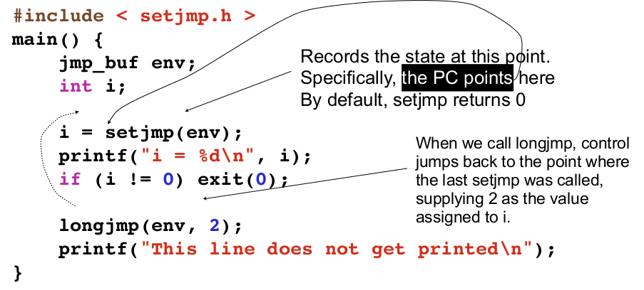
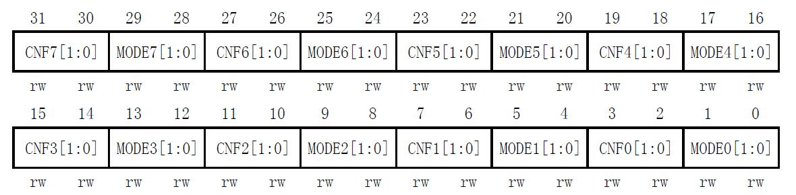
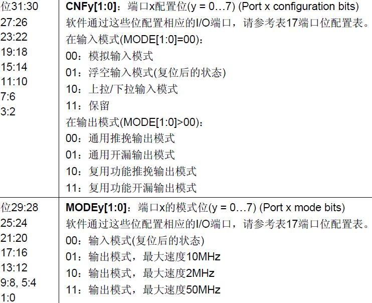
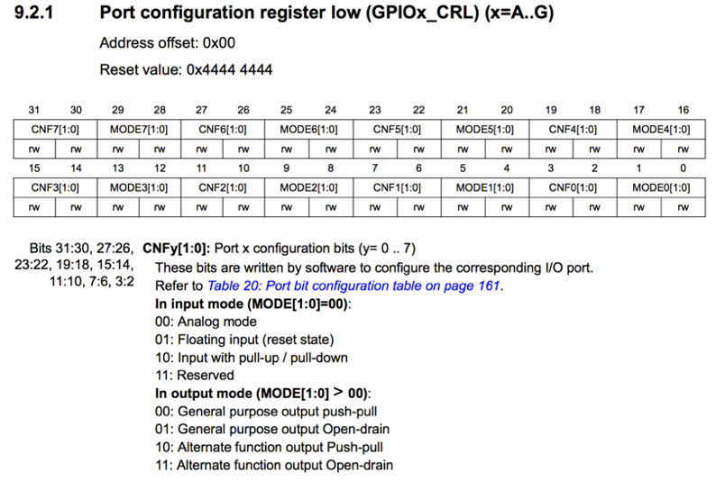
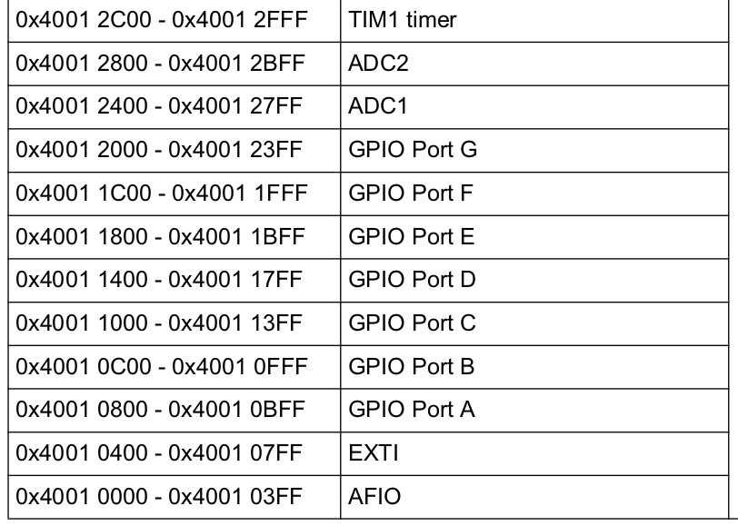

# 编译预处理、错误处理和底层程序设计

* 编译预处理
* 错误处理
* 日志
* 底层程序设计 

---

# 编译预处理

* C语言的预处理主要有三个方面的内容： 
	1. 宏定义； 
	2. 文件引用（包含）； 
	3. 条件编译。 
* 预处理命令以符号“#”开头
* 在编译预处理阶段，预处理程序读取c源程序，对其中的预处理指令指令和特殊符号进行处理。或者说是扫描源代码，对其进行初步的转换，产生新的源代码提供给编译器。预处理过程先于编译器对源代码进行处理

---

# #运算符

* 出现在宏定义中的#运算符把跟在其后的参数转换成一个字符串。有时把这种用法的#称为字符串化运算符。例如：
`#define PRINT_INT(n) printf(#n "=%d", n)`
*预处理后这里会出现两个连着的字符串，会被合并为一个*
* 又如：
```
#define PASTE(n) "adhfkj"#n
int main()
{
       printf("%s\n",PASTE(15));
       return 0;
}
```
* 可以用`--save-temps`选项编译后看到预处理的结果

---

# ##运算符

##运算符用于把参数连接到一起。预处理程序把出现在##两侧的参数合并成一个符号。看下面的例子：

```
#define MYCASE(item,id) \
case id: \
  item##_##id = id;\
break
 
switch(x) {
    MYCASE(widget,23);
}
```

---

# Arduino的Ethernet库

http://wengkai.github.io/cmacro/cmacro.html

```
#define __GP_REGISTER8(name, address)             \
  static inline void write##name(uint8_t _data) { \
    write(address, _data);                        \
  }                                               \
  static inline uint8_t read##name() {            \
    return read(address);                         \
  }
```
* `__GP_REGISTER8 (TMSR,   0x001B);`会被展开成：
```
static inline void writeTMSR(uint8_t _data) { 
    write(0x001B, _data);                        
  }                                               
  static inline uint8_t readTMSR() {            
    return read(0x001B);                         
  }
```

---

# 预定义的宏

* `__FILE__`：源代码文件名，字符串
* `__LINE__`：源代码中的行号，整数
* `__func__`：当前所在函数名
* `__DATE__`：编译的日期，字符串
* `__TIME__`：编译的时间，字符串

w4-1.c

* 常用于产生自动的版本和调试或日志信息

---

# 变长参数的宏

* 宏可以接受可变数目的参数，就象函数一样，例如：
```
#define pr_debug(fmt,arg...) \
printk(KERN_DEBUG fmt,##arg)
```
* 这里其实是使用了##运算符将可变部分组合给了printk的参数列表
* 可变参数宏的可变部分也可以没有名字：

`#define debug(…) printf(__VA_ARGS__)`

* 缺省号代表一个可以变化的参数表。使用保留名 __VA_ARGS__ 把参数传递给宏。当宏的调用展开时，实际的参数就传递给 printf()了

---

# 条件编译

* 假如现在要开发一个C语言程序，让它输出红色的文字，并且要求跨平台，在 Windows 和 Linux 下都能运行，怎么办呢？
* 这个程序的难点在于，不同平台下控制文字颜色的代码不一样，我们必须要能够识别出不同的平台
* Windows 有专有的宏`_WIN32`，Linux 有专有的宏`__linux__`

---

# #ifdef #else #endif

`#ifdef 标识符    程序段1#else    程序段2#endif`

* 如果标识符已被 #define命令定义过则对程序段1进行编译；否则对程序段2进行编译。如果没有程序段2(它为空)，这里的#else可以没有
```
#ifdef NUM
    printf("Number=%d\nScore=%f\n",ps->num,ps->score);
#else　
    printf("Name=%s\nSex=%c\n",ps->name,ps->sex);
#endif
```
* 用编译选项`--save-temps`可以看预处理的结果

---

# 调试版本

```
int main()
{
    #ifdef _DEBUG
        printf("正在使用 Debug 模式编译程序...\n");
    #else
        printf("正在使用 Release 模式编译程序...\n");
    #endif
}
```
w4-3.c

* 这样调试版本和发布版本就可以有不同的代码
* 编译时加上选项`-D _DEBUG`就可以编译调试版本


---


# 条件编译

```
int main()
{
    #if _WIN32
        system("color 0c");
        printf("Win: C Programming\n");
    #elif __linux__
        printf("\033[22;31mLinux: C Programming\n\033[22;30m");
    #else
        printf("C Programming\n");
    #endif
    return 0;
}
```
* 如果宏 _WIN32 的值非0，就保留第 6、7 行代码，删除第 9、11行代码；如果宏 __linux__ 的值非0，就保留第 9 行代码；如果所有的宏都为0，就保留第 11 行代码。```

---

# 注释大段代码

* 当程序中有大段代码需要被临时注释掉，使用`/* */`或`//`注释都不太方便，尤其是当代码中原本就有注释时
	* 原本有`/* */`注释时，会和后加的`/* */`冲突
	* 再加上`//`注释可能使得代码存在多重`//`
* 可以用`#if 0...#endif`来注释这段代码

---

# 条件编译的例子

* 在工程代码中有大量的条件编译的例子，俯拾皆是：
```
/* define compiler specific symbols */
#if defined ( __CC_ARM   )
  #define __ASM            __asm                                      /*!< asm keyword for ARM Compiler          */
  #define __INLINE         __inline                                   /*!< inline keyword for ARM Compiler       */

#elif defined ( __ICCARM__ )
  #define __ASM           __asm                                       /*!< asm keyword for IAR Compiler          */
  #define __INLINE        inline                                      /*!< inline keyword for IAR Compiler. Only avaiable in High optimization mode! */

#elif defined   (  __GNUC__  )
  #define __ASM            __asm                                      /*!< asm keyword for GNU Compiler          */
  #define __INLINE         inline                                     /*!< inline keyword for GNU Compiler       */

#elif defined   (  __TASKING__  )
  #define __ASM            __asm                                      /*!< asm keyword for TASKING Compiler      */
  #define __INLINE         inline                                     /*!< inline keyword for TASKING Compiler   */

#endif
```
core_cm3.c

---

# #error

stm32f10x.h
```
#ifdef STM32F10X_CL   
  #define HSE_VALUE    ((uint32_t)25000000) /*!< Value of the External oscillator in Hz */
 #else 
  #define HSE_VALUE    ((uint32_t)8000000) /*!< Value of the External oscillator in Hz */
```
* 这里用`STM32F10X_CL`这样的宏来定义所用的芯片类型，从而选择诸如主频这样的参数
* 在Makefile中`MACRO = -DSTM32F10X_LD -DUSE_STDPERIPH_DRIVER`就选择了对应的芯片（见Makefile）
* 而如果没有定义正确的芯片类型就来编译，那么下面的代码：
```
#if !defined (STM32F10X_LD) && !defined (STM32F10X_LD_VL) && !defined (STM32F10X_MD) && !defined (STM32F10X_MD_VL) && !defined (STM32F10X_HD) && !defined (STM32F10X_HD_VL) && !defined (STM32F10X_XL) && !defined (STM32F10X_CL)
 #error "Please select first the target STM32F10x device used in your application (in stm32f10x.h file)"
#endif
```
* 就会产生编译错误，`#error`产生一个编译错误

---

# #pragma

* 设定编译器的状态或者是指示编译器完成一些特定的动作。
* `#pragma`指令对每个编译器给出了一个方法，在保持与C和C++语言完全兼容的情况下，给出主机或操作系统专有的特征。
* 依据定义，编译指示是机器或操作系统专有的，且对于每个编译器都是不同的
* 因此尽量避免使用`#pragma`

---

# 错误处理

* 程序运行过程中，不可避免会出现一些情况，不是由于程序员的主观错误，而是运行时的客观情况，导致某些代码无法正常执行
* 如果要打开文件读取其中数据，可能的伪代码如下：
```
打开文件
获取文件大小
申请内存空间
读入文件数据
关闭文件
```
* 这里的每一步都可能在运行时遇到问题
* 这些问题是可以预见的、一定存在发生的可能的、不是一定会发生的

---

# 返回特殊值

* C标准库中的IO函数，均会通过返回的特殊值来表示函数执行过程中出了问题，如：
	* `malloc`返回`NULL`表示没有空间了
    * `fopen`返回`NULL`表示文件没有打开
	* `open`返回`-1`表示文件没有打开
	* `printf`返回输出了多少个字符，如果少于预期就是错误
	* `scanf`返回给多少个变量做了赋值，如果少于预期就是错误
* 一个健壮的程序应该判断所有这些函数的返回值，包括`malloc`和`printf`
* 使用每一个库函数（包括第三方库）之前都应该检查函数的说明，看返回值的意义
* 如`man scanf`就可以看scanf的说明

---

# 返回特殊值

* 设计自己的函数的时候，也可以用这个方式返回特殊值来告诉调用者在这个函数执行中出现了问题
* 当函数的返回值是全域的，就无法找到特殊值来表示错误，如：
```
int divide(int a, int b) {
    return a/b;
}
```
如何处理b为0的情况？

---

# 返回错误

* 函数返回值表示错误与否，用参数带回结果
```
int divide(int a, int b, int* result) 
{
    int ret = 1;
    if ( b ) {
    	*result = a/b;
    } else {
        ret = 0;
    }
    return ret;
}
int c=0;
if ( divide(20,3,&c) ) {
    printf("%d\n", c);
} else {...
```
---

# 全局错误值

* 通过全局变量（或静态全局变量）和配套的函数来表达错误
* C标准库中的`errno`是记录系统的最后一次的错误编码。这个编码是一个int型的值，在errno.h中定义
* 当C标准库函数发生异常时，一般会将`errno`变量赋一个整数值，不同的值表示不同的含义，可以通过查看该值推测出错的原因
* 查看错误编码`errno`是调试程序的一个重要方法

---

# `open()`

* 标准库的`open`函数的说明中：

`If successful, open() returns a non-negative integer, termed a file descriptor.  It returns -1 on failure, and sets errno to indicate the error.`

* 当`open()`返回-1时，就可以查看`errno`的值来得知具体的错误

---

# `errno`

* 以下是一些错误值的例子：
```
#define EPERM 1 /* Operation not permitted */
#define ENOENT 2 /* No such file or directory */
#define ESRCH 3 /* No such process */
#define EINTR 4 /* Interrupted system call */
#define EIO 5 /* I/O error */
```

---

# 查看错误信息文本

* 下面几种方法可以方便的得到错误信息:
* `void perror(const char *s)`
	* perror()用来将上一个函数发生错误的原因输出到标准错误(stderr),参数s 所指的字符串会先打印出,后面再加上错误原因字符串。此错误原因依照全局变量 errno 的值来决定要输出的字符串。
* `char *strerror(int errno)`
	* 将错误代码转换为字符串错误信息,可以将该字符串和其它的信息组合输出到用户界面例如
`fprintf(stderr,"error in CreateProcess %s, Process ID %d ",strerror(errno),processID)`

---

# 设计自己的全局错误变量

* 宜将全局错误变量封装为`static`全局变量，以禁止外部的直接访问
* 对外通过类似`perror`、`strerror`、`geterror`这样的函数来读取这个错误变量的值

---

# `setjump`和`longjump`

* 在 C 语言中，我们不能使用 goto 语句来跳转到另一个函数中的某个 label 处；但提供了两个函数——`setjmp` 和 `longjmp`来完成这种类型的分支跳转

```
void f()
{
    //...
    Label:
    //...
}

void g()
{
    //...
    GOTO Label;
    //...
}
```
* 这里的`GOTO`直接用`goto`是不行的

---

# 函数间跳转

* 实现这种类型的跳转，和操作系统中任务切换的上下文切换有点类似，我们只需要恢复 Label 标签处函数上下文即可。函数的上下文包括以下内容：
	* 函数栈帧，主要是栈帧指针BP和栈顶指针SP
	* 程序指针PC，此处为指向 Label 语句的地址
	* 其它寄存器，这是和体系相关的
* 这样，在执行 `GOTO Label; `这条语句时，只要恢复 Label 处的上下文，即完成跳转到 Label 处的功能
* `setjmp` 和 `longjmp` 实现这样的保存上下文和切换上下文的工作

---

# `setjump`
声明在<setjmp.h>中
`int setjmp(jmp_buf env);`

* `setjmp` 函数的功能是将函数在此处的上下文保存在 `jmp_buf` 结构体中，以供 `longjmp` 从此结构体中恢复。
* 如果直接调用该函数，返回值为 0； 
* 若该函数从 longjmp 调用返回，返回值为非零，由 longjmp 函数提供
* 根据函数的返回值，我们就可以知道 setjmp 函数调用是第一次直接调用，还是由其它地方跳转过来的。

---

# `longjump`

`void longjmp(jmp_buf env, int val);`

* `longjmp` 函数的功能是从 `jmp_buf` 结构体中恢复由 `setjmp` 函数保存的上下文，该函数不返回，而是从 `setjmp` 函数中返回。
* 参数`val` 表示从 `longjmp` 函数传递给 `setjmp` 函数的返回值，如果 `val` 值为0， `setjmp` 将会返回1，否则返回 `val`
* `longjmp` 不直接返回，而是从 `setjmp` 函数中返回，`longjmp` 执行完之后，程序就像刚从 `setjmp` 函数返回一样

---



---

# 异常处理

```
static jmp_buf env;

double divide(double to, double by)
{
    if(by == 0)
        longjmp(env, 1);
    return to / by;
}

int main() 
{
    if (setjmp(env) == 0)
        divide(2, 0);
    else
        printf("Cannot / 0\n");
    printf("done\n");
}
```
w4-5.c

---

# 断言

* `assert`是一个宏，定义在<assert.h>中，作用是如果它的值是0，则终止程序执行
	* `assert(expression);`
* 如果其值为假（即为0），那么它先向stderr打印一条出错信息，然后通过调用 `abort()` 来终止程序运行
* 错误信息如下：
```
"assertion \"%s\" failed: file \"%s\", line %d\n", \
"expression", __FILE__, __LINE__);
```

---

# 断言的用法

* 断言是用来发现程序员的错误的
* 断言用在函数入口处，检查函数的参数值是否在有效的范围内
```
/**
    改变缓冲区大小, 
    保持原信息内容不变，nNewSize<=0表示清除缓冲区
    @param nNewSize 缓冲区新长度
    @return 缓冲区当前长度 
　　
*/　　
int resetBufferSize(int nNewSize)
{
　　assert(nNewSize >= 0);
　　assert(nNewSize <= MAX_BUFFER_SIZE);
　　...
}
```
* 如果调用`resetBufferSize`的程序员给出了错误的`nNewSize`值，程序就会终止
---

# 断言的调试和发布版本

* 每个函数入口都检查参数的范围显然会影响程序执行的效率
* 断言是在程序调试期间保证函数之间的调用传参是正确的
* 调试完成后，发布的时候就不再需要了
* 在编译时加上选项`-DNDEBUG`就可以将所有的`assert`宏取消

```
#ifdef NDEBUG
#define	assert(e)	((void)0)
```
assert.h

---

# 错误的断言

* 断言不应使用在判断程序运行状态的地方
	* 如IO操作的结果
	* 用户输入的数据有效性
* 每个断言只检验一个条件，因为同时检验多个条件时，如果断言失败，无法直观的判断是哪个条件失败，如：
`assert(nOffset>=0 && nOffset+nSize<=m_nInfomationSize);`不好，应分成两个断言
* 断言的条件中应做赋值，如：
`assert(i++ < 100);`，因为i++不一定被执行

---

# 断言和用户输入

```
int resetBufferSize(int nNewSize)
{
　　assert(nNewSize >= 0);
　　assert(nNewSize <= MAX_BUFFER_SIZE);
　　...
}
```
* 如果调用`resetBufferSize`的地方，是从用户输入得到`nNewSize`的，应该在读入数据后即进行有效性检查，而不是放纵进入`resetBufferSize`来做断言

---

# 程序的调试

* 没有人能够保证一次写出来的代码是百分之百正确的，代码写好过后要进行充分的测试 ( 包括单元测试和集成测试）。作为一名软件开发人员，必须要学会对程序进行测试，也就是要学会程序的调试。调试的方法有：
	* 凭肉眼看
	* 对代码进行编译，以发现语法错误 
	* 用代码检查工具 ( 如 Pclint 等 ) 来走查代码
	* 对代码进行跟踪调试
	* 对程序的日志文件进行分析

---

# 日志

* 对代码的单步调试只在代码行数较少的时候比较适用，如教材上面的程序。但在实际的软件项目中，代码少则几千行，多则数万行，用单步调试的方法显然不恰当
* 为了跟踪某一变量值的变化，用该方法可能要花费几个小时，这对工作效率产生了严重影响
* 为了解决大程序文件代码调试问题，日志系统应运而生。
* 在程序中的重要地方打印日志，之后对产生的日志进行分析，可找到对应代码的问题
* 因此，日志文件分析成了大型软件项目中代码调试的主要手段

---


# 日志

* 日志一般用于记录程序运行信息，从而使开发者方便调试，了解生产环境执行情况
* 用IDE的调试功能，或命令行的gdb进行单步跟踪调试虽然方便，但是在很多情况下是很难甚至无法进行的
	* 程序的运行严重依赖于时间，一旦停下来单步，就会错过输入
	* 程序运行于远程计算机上，难以跟踪调试
	* 程序运行于嵌入式设备上，缺少调试手段
* 设计良好的日志输出，通过事后或实时分析日志输出来推断程序运行情况和发生错误的地方，是工程实践中非常有效的调试手段

---

# `printf`做日志输出

* 常见有人直接用`printf`输出一些信息和数据来做日志/调试输出
* 通过运行程序时将输出重定向到文件，就可以保存日志
`nohup ./run > log &` : 持续运行run，将输出保存到log文件中
`tail -f log` ： 持续查看log文件最新添加的内容，实现实时查看

---

# `printf`做日志的问题

* 简单的程序调试也许可行，但是在工程中有几个致命的缺点：
	* 无法区分不同的测试级别来输出不同详细程度的日志
	* 无法在调试和发布版本中输出不同的日志
	* 由于通常不检查`printf`的返回结果，在嵌入式Linux系统中可能造成磁盘空间用罄导致系统崩溃
* 因此需要设计专门的日志函数库来实现日志输出

---

# 日志库

* 日志函数的基本功能有：
	* 输出一条日志
	* 设置当前的日志输出级别

---

# 日志级别

* 事有轻重缓急，日志信息也有重要与不重要之分。一般按照重要程度，将日志等级分为几类，如：

```
enum LOG_LEVEL {
	LOG_NULL,	// 不输出信息
	LOG_FATAL,	// 严重错误
	LOG_ERROR,	// 一般错误
	LOG_WARN,	// 警告信息
	LOG_INFO,	// 一般信息
	LOG_TRACE,	// 跟踪信息
	LOG_DEBUG,	// 调试信息
	LOG_ALL,	// 输出全部信息
}
```
* 开发人员根据所要打印的日志的具体情况采用不同的日志等级

---

# 日志输出函数

`void log_write(int log_level, const char* fmt, ...);`

* 利用变长参数函数，就可以实现任意内容的日志输出
* `log_level`表示这条日志信息的级别，当当前设置的输出级别大于该级别时才输出这条日志
* 通常会自动加上时间等信息

---

# 日志输出函数

* 实际的日志输出函数要处理诸多特殊情况：
	* 输出不一定是到标准输出，通常是文件，甚至可能是串口或网络流
	* 是否要将日志以日为单位分文件存储？（每天一个日志文件）
	* 是否要将日志以大小为单位分文件存储？（每xxxMB一个日志文件）
	* 是否要自动压缩旧的日志文件
	* 是否要删除很旧的日志文件（如1年前的）
	* 或在存储空间紧张时删除旧的文件

---

# 日志配置

* 这些复杂的输出要求通常通过日志配置来实现，有两种常见做法：
	* 在Linux这样的系统上，采用配置文件，程序从配置文件中读入各种设置参数，然后通过日志库的设置函数来配置
	* 在嵌入式系统上，则往往采用宏来控制，通过在Makefile中设置不同的宏，在日志库中通过条件编译来实现不同的配置

---

# 输出日志位置要求

* 所有的输入输出，包括收消息和发消息都要求输出日志
* 关键控制点必须输出日志
* 调用底层或第三方软件，必须输出日志，而且对不可靠底层，必须加上 begin/end 两行日志
* 对方系统处理时间必须输出日志，以利以后维护时快速定位性能问题

---

# 日志编写基本原则

* 显式输出，关键信息必须输出
* 在编码时使用正确的日志级别， error 错误和 warning 错误必须反应出实在的含义，不是特别严重的问题不能将日志等级定义为 LOG_FATAL
* 在写日志描述时，要使用正常简单易懂的语言，不能使用晦涩难懂的语言或某些专业术语
* 在极少数特殊情况不希望用户知道时，可使用特殊日志标记；
* 为了写出优美的代码，在自己修改或添加代码的地方，都要正确的打上标记 ( 包括作者、日期信息等 ) ，方便追踪版本的演进情况

---

# 日志注意事项

* 在编写日志时需要注重日志细节，目标是为了方便以后维护，在遇到问题时，可以快速定位问题
* 不要在同一行中写意思重复的日志
* 日志需要足够的精简，不要随意换行
* 日志中字段之间可以用空格或其它符号分断，不能将日志一直连续而不将其分断，尽量使日志本身具备进行“识文断句”的能力
* 对于日志中的特殊信息 (如会话号、 IP 地址等) ，用特殊的符号进行标识，其主要目的是为了便于搜索

---

# 底层程序设计

* 位运算
* 位段
* 单片机中常见的技术

---

# 位运算

* 所谓位运算，就是对一个比特（Bit）进行操作
* C语言提供了六种位运算符：

| 运算符 | `&` | `|` | `^` | `~` | `<<` | `>>` |
|:-:|:-:|:-:|:-:|:-:|:-:|:-:|
| 说明|与|或|异或|取反|左移|右移|

---

# 有无符号的移位

* 有符号的数在移位时，最高位不参与移位，以保持符号不变
* 常用`1<<n`来得到第n位为1的数
	* `1 << 31`并不能得到`0x8000000`，因为1是有符号的
	* `1ul << 31`才行
* 用移位可以实现乘2除2的快速计算，但是不建议在C中这样写
	* 编译器会帮你实现优化的

---

# 置位和复位

* 计算机术语中的置位（set）意思是使某位为1，复位（reset）意思是使某位为0，而非它们字面上的意思
* 假设某寄存器的3、4两位需要做置位和复位操作，一般的做法是：
	* `key = 1ul << 3 | 1ul << 4;`：得到3、4两位上为1的数
	* `reg |= key`：置位reg里这两位
	* `reg &= ~key`：复位reg里这两位

---
# STM32F103的端口配置低寄存器(GPIOx_CRL) (x=A..E)


---



---

# 如何取出一个值的每一位

```
unsigned int x = 0xcafebabe;
unsigned int mask = 1ul<<31;
while ( mask ) {
	if ( x & mask ) {
		printf("1");
	} else {
		printf("0");
	}
	mask >>= 1;
}
printf("\n");
```
w4-6.c

---

# 位段

* 位段(bit-field)是以位为单位来定义结构体(或联合体)中的成员变量所占的空间。含有位段的结构体(联合体)称为位段结构。采用位段结构既能够节省空间，又方便于操作
```
struct node
{
    unsigned int a:4;     //位段a，占4位
    unsigned int  :0;     //无名位段，占0位
    unsigned int b:4;     //位段b，占4位
    int c:16;             //位段c，占16位
    int  :6;              //无名位段，占6位
};
```
* 在结构声明中，在每个成员后面加上`:<位数>`就定义了位段

---

# 位段成员

* 位段成员的类型只能是int，unsigned int，signed int三种类型，不能是char型或者浮点型
* 位段占的二进制位数不能超过该基本类型所能表示的最大位数，比如在VC中int是占4个字节，那么最多只能是32位
* 无名位段不能被访问，但是会占据空间
* 不能对位段进行取地址操作
* 对位段赋值时，不要超过位段所能表示的最大范围
* 大多数C 编译器都不支持超过一个字长的位段
* 位段结构中未声明位数的成员占据剩下的空间
* 总的空间是所有的位数之和ceil到n个int
	* 如总和30位则占据32位空间，总和33位则占据64位空间

---

# 位段应用

* 位段用于两种场合：
	* 节省空间，不过不是很有必要
	* 表达二进制选项，如寄存器的各个比特，可以如引用一般的结构成员一样方便地引用

---

# 可组合的选项

* C标准库的`open`函数的原型是`int open(const char *path, int oflag, ...);`
* 这里的oflag是以下量的‘或’的结果：
```
O_RDONLY        open for reading only
O_WRONLY        open for writing only
O_RDWR          open for reading and writing
O_NONBLOCK      do not block on open or for data to become available
O_APPEND        append on each write
O_CREAT         create file if it does not exist
O_TRUNC         truncate size to 0
O_EXCL          error if O_CREAT and the file exists
O_SHLOCK        atomically obtain a shared lock
O_EXLOCK        atomically obtain an exclusive lock
O_NOFOLLOW      do not follow symlinks
O_SYMLINK       allow open of symlinks
O_EVTONLY       descriptor requested for event notifications only
O_CLOEXEC       mark as close-on-exec
```
---

在fcntl.h中可以找到这些量：
```
#define	O_RDONLY	0x0000		/* open for reading only */
#define	O_WRONLY	0x0001		/* open for writing only */
#define	O_RDWR		0x0002		/* open for reading and writing */
#define	O_NONBLOCK	0x0004		/* no delay */
#define	O_APPEND	0x0008		/* set append mode */
#define	O_SHLOCK	0x0010		/* open with shared file lock */
#define	O_EXLOCK	0x0020		/* open with exclusive file lock */
#define	O_ASYNC		0x0040		/* signal pgrp when data ready */
#define	O_CREAT		0x0200		/* create if nonexistant */
#define	O_TRUNC		0x0400		/* truncate to zero length */
#define	O_EXCL		0x0800		/* error if already exists */
```
* 它们都是只有一个比特为1的值
* 当把它们“或”起来，就会在不同的位上出现1
* 根据哪个位上有1就知道选择了哪些选项
* 请设计对应的位段结构
	* 需要测试得知位段中的比特排列是从高到低还是反过来

---

# 位段表达寄存器


* 对于上图的寄存器结构，如何设计位段来方便地访问其中的内容？

---

# 不依赖实现的数据类型

* `typedef int int32`
	* 这是为了在不同的芯片上定义统一的数据类型`int32`
* 如果直接用`int`类型，在16位和32位芯片上的大小可能是不同的
* 新的GNU编译器已经将`int`统一为32位了
* 但是单片机编译器很可能还是会有不同的`int`大小

---

# stdint.h

* 定义了各种int

```
/* 7.18.1.2 Minimum-width integer types */
typedef int8_t           int_least8_t;
typedef int16_t         int_least16_t;
typedef int32_t         int_least32_t;
typedef int64_t         int_least64_t;
typedef uint8_t         uint_least8_t;
typedef uint16_t       uint_least16_t;
typedef uint32_t       uint_least32_t;
typedef uint64_t       uint_least64_t;
```

---

# 用结构访问连续的内存

* 在Drivers/BSP/STM32F1xx_Nucleo/stm32f1xx_nucleo.h中
`#define LED2_GPIO_PORT                   GPIOA`
* 而Drivers/CMSIS/Device/ST/STM32F1xx/Include/stm32f103xb.h
中
```
#define GPIOA               ((GPIO_TypeDef *) GPIOA_BASE)
#define GPIOA_BASE            (APB2PERIPH_BASE + 0x0800)
#define APB2PERIPH_BASE       (PERIPH_BASE + 0x10000)
#define PERIPH_BASE           ((uint32_t)0x40000000)
```
* 因此`LED2_GPIO_PORT`就是
`0x40000000+0x10000+0x800  —> 0x40010800`

---

# STM32的芯片手册CD00171190.pdf



---

# 寄存器地址



* 寄存器地址就是一个“内存”地址

---

# GPIO_TypeDef

```
typedef struct
{
  __IO uint32_t CRL;
  __IO uint32_t CRH;
  __IO uint32_t IDR;
  __IO uint32_t ODR;
  __IO uint32_t BSRR;
  __IO uint32_t BRR;
  __IO uint32_t LCKR;
} GPIO_TypeDef;
```

* 于是，`LED2_GPIO_PORT->CRH`就是访问0x40010804这个寄存器

---

# volatile类型修饰

* volatile提醒编译器它后面所定义的变量随时都有可能改变，因此编译后的程序每次需要存储或读取这个变量的时候，都会直接从变量地址中读取数据。如果没有volatile关键字，则编译器可能优化读取和存储，可能暂时使用寄存器中的值，如果这个变量由别的程序更新了的话，将出现不一致的现象
```
int flag;
void test()
{
    do1();
    while(flag==0)
        ;
    do2();
}
```
* 在这个循环中不会修改flag的值，单纯看这段代码就是个死循环
* flag是由其他线程或中断修改的

---

# 例子：查看内存（[1]371）

---

# 作业

* 实现一个日志库，要求：
	* 具有多个日志级别
	* 能输出任意数量的格式内容
	* 能输出到标准输出或文件
	* 输出时带有时间信息
	* 能每天生成一个新文件


