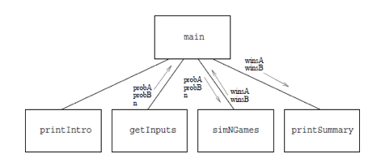
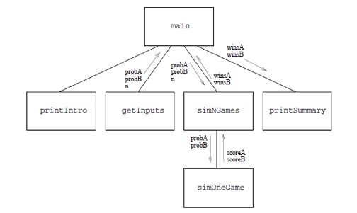
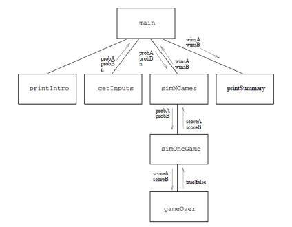
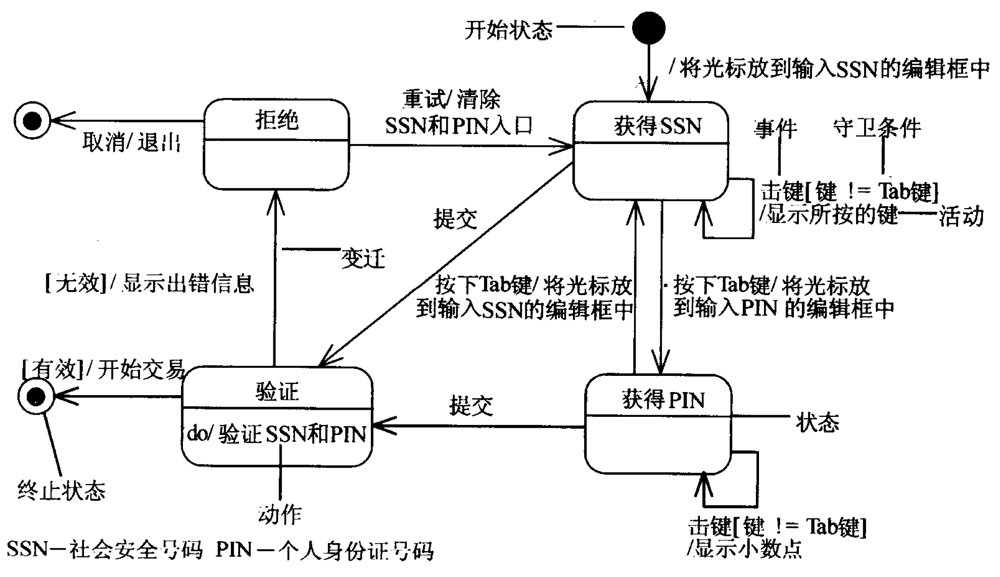

# 设计和设计模式

* 自顶向下的设计
* 设计模式

---

# 模拟分析

* 模拟是用来解决现实世界问题的重要手段和技术。计算机可以通过模拟现实世界的运行过程提供一般情况下无法获得的信息
* 使用计算机模拟解决问题的实例包括：天气预测、飞机设计、电影特效、核试验甚至军事对抗等。如果不采用计算机模拟，这些应用则需要极其复杂的实施过程，往往代价巨大。即使很简单的模拟也可以揭示一些困难问题的本质规律

---

# 模拟和仿真

* 模拟（simulation）是抽象原系统某些行为特征并用另一系统来表示这些特征的过程，通常用于设计初期的模型验证
* 仿真（emulation）则更进一步，需要模仿系统真实能做的事情，接收同样的数据，获得同样的结果，只不过实现的“过程”不同。仿真一般用于处理兼容性问题或在资源有限条件下实现系统原型

---

# 体育竞技分析：规则

* 从各种球类比赛中抽象一般规则，规则定义如下：
* 两个球员在一个有四面边界的场地上用球拍击球。开始比赛时，其中一个球员首先发球。接下来球员交替击球，直到可以判定得分为止，这个过程称为回合。当一名球员未能进行一次合法击打时，回合结束。未能打中球的球员输掉这个回合
* 如果输掉这个回合的是发球方，那么发球权交给另一方；如果输掉的是接球方，则仍然由这个回合的发球方继续发球。总之，每回合结束，由赢得该回合的一方发球。球员只能在他们自己的发球局中得分。首先达到15 分的球员赢得一局比赛

---

# 计算机模拟

* 在计算机模拟中，运动员的能力级别将通过发球方赢得本回合的概率来表示。因此，一个0.6概率的球员可以在他的发球局有百分之六十的可能性赢得1分。程序首先接收两个球员的水平值，然后通过利用这个值采用概率方法模拟多场比赛。程序最后会输出比赛运行结果。

---

# IPO模式

* 该问题的IPO（Input-Process-Output）模式如下：
	* 输入：两个球员（球员A 和B）的能力概率，模拟比赛的场次；
	* 处理：模拟比赛过程；
	* 输出：球员A 和B 分别赢得球赛的概率
* 抽象这个问题时，将球员失误、犯规等可能性一并考虑在能力概率中，在每局比赛中，球员A 先发球
* 一个可能的输出结果如下
```
模拟比赛数量：500
球员A 获胜场次：268（53.6%）
球员B 获胜场次：232（46.4%）
```

---

# 自顶向下设计方法

* 程序需要采用自顶向下设计方法，采用自底向上的测试过程
* 以一个总问题开始，试图把它表达为很多小问题组成的解决方案。再用同样的技术依次攻破每个小问题，最终问题变得非常小，以至于可以很容易解决。然后只需把所有的碎片组合起来，就可以得到一个程序

---

# 顶层设计

* 自顶向下设计中最重要的是顶层设计
* 以体育竞技分析为例，可以从问题的IPO描述开始。大多数程序都可以简单将IPO 描述直接用到程序结构设计中，体育竞技分析从用户得到模拟参数模拟比赛，最后输出结果

---

# 顶层设计

1. 步骤1: 打印程序的介绍性信息；
2. 步骤2：获得程序运行需要的参数：probA, probB, n；
3. 步骤3：利用球员A 和B 的能力值probA 和probB，模拟n 次比赛；
4. 步骤4：输出球员A 和B 获胜比赛的场次及概率。

---

# 顶层设计

* 步骤1: 打印程序的介绍性信息；
```
int main()
{
    printIntro();
    ...
```
* 顶层设计一般不写出具体代码，仅给出函数定义，这里`printIntro()`函数打印一些必要的说明

---

# 顶层设计

* 步骤2 获得用户输入

```
int main()
{
    double probA, probB;
    int n;
    
    printIntro();
    getInputs(&probA, &probB, &n);
```

* 通过函数将输入语句及输入格式等细节封装或隐藏，只需要假设程序如果调用了getInputs()函数即可获取变量 probA， probB 和 n 的值

---

# 顶层设计

* 步骤3 需要使用probA、probB 模拟n场比赛。
* 此时，可以采用解决步骤2的类似方法，设计一个simNGames()函数来模拟n场比赛，并返回结果。按照体育竞技问题的要求，该函数需要模拟比赛，并获得球员A 和球员B 赢得比赛的结果
```
int main()
{
    double probA, probB;
    int n;
    
    printIntro();
    getInputs(&probA, &probB, &n);
    int winsA = simNGames(n, probA, probB);
    
```

---

# 顶层设计

* 步骤4 输出结果，设计思想类似，仍然只规划功能和函数
```
int main()
{
    double probA, probB;
    int n;
    
    printIntro();
    getInputs(&probA, &probB, &n);
    int winsA = simNGames(n, probA, probB);
    printSummay(n, winsA);    
```

---

# 顶层设计

* 原问题被划分为了4 个独立的函数：printIntro()，getInputs()，simNGames()和printSummary()。分解过程让程序员在这一步不必关心具体细节而专心考虑程序的结构设计



---

# 第 n 层设计

* 每层设计中，参数和返回值如何设计是重点，其他细节部分可以暂时忽略。确定事件的重要特征而忽略其它细节过程称为抽象
	* 有两种抽象，常见的是和具体相对的抽象
	* 这里的是和细节相对的抽象
* 自顶向下设计的第二阶段是实现或进一步抽象第2 层函数

---

# 第 n 层设计

* simNGames()函数是整个程序的核心，其基本思路是模拟n场比赛，并跟踪记录每个球员赢得了多少比赛
```
int simNGames(int n, double probA, double probB)
{
	int ret = 0;
    for ( int i=0; i<n; i++ ) {
    	if ( simOneGame(probA, probB) == 0 ) {	
        	//	returns 0 means that A wins
        	ret ++;
        }
    }
    return ret;
}
```

---

# 第 n 层设计

* `simNGames()`又一次地展开了，依赖`simOneGame()`



---

# 第 n 层设计

* 接下来需要实现simOneGame()函数。在模拟比赛的循环中，需要考虑单一的发球权和比分问题，通过随机数和概率，可以确定发球方是否赢得了比分（random() < proB）。如果球员A发球，那么需要使用A 的概率，接着根据发球结果，更新是否球员A 得分还是将球权交给球员B

---

```
int simOneGame(double probA, double probB)
{
    int ret = 0;
    int scoreA = 0;
    int scoreB = 0;
    int serving = 0;	//	0 for A; 1 for B
    while ( !gameOver(scoreA, scoreB) ) {
    	if ( serving == 0 ) {
        	if ( rand()/RAND_MAX < probA ) {
            	scoreA ++;
            } else {
            	serving = 1;
            }
        } else {
        	if ( rand()/RAND_MAX < probB ) {
            	scoreB ++;
            } else {
            	serving = 0;
            }
        }
    }
    return ret;
}
```
---

* 这里进一步设计了gameOver()函数，用来表示一场比赛结束的条件，对于不同体育比赛结束条件可能不同，封装该函数有助于简化根据不同规则修改函数的代价，提高代码可维护性。gameOver()函数跟踪分数变化并在比赛结束时返回True，未结束则返回False。然后继续循环的其余部分。



---

# Game Over

* 根据比赛规则，当任意一个球员分数达到15 分时比赛结束。gameOver() 函数实现代码如下

```
int gameOver(int scoreA, int scoreB)
{
	return scoreA == 15 || scoreB == 15;
}
```

---

# 设计过程

* 结合体育竞技实例介绍了自顶向下的设计过程。从问题输入输出确定开始，整体设计逐渐向下进行。每一层以一个大体算法描述，然后逐步细化成代码，细节被函数封装
	* 步骤1：将算法表达为一系列小问题
	* 步骤2：为每个小问题设计接口
	* 步骤3：通过将算法表达为接口关联的多个小问题来细化算法
	* 步骤4：为每个小问题重复上述过程

---

# 工程中的自顶向下

* 虽然是最浅显的设计原则，在工程中却很容易受到挑战，也常让新人看走眼
* 一方面，程序员很容易一时冲动，急于在一个点上一头扎到底，而不是一层层地往下深入，
	* 这样做最大的问题是无法形成全局的层次结构，没有结构意味着很难形成今后其他产品可以重用的代码
	* 即使有层次结构，由于在设计代码时没有考虑其他部分的需要，函数接口也往往是不合适的

---

# 工程中的自顶向下

* 另一方面，企业做产品很少从零开始，很多功能模块、基础架构都有现成的可重用的代码，而这些代码往往都是底层的
* 另外在设计阶段很可能会需要尝试一些新技术、新器件，这些尝试性的代码也都是底层的，在整体结构设计之前就做了
	* 于是会让新人误以为设计是从底向上进行的

---

# 设计模式

* 虽然设计模式的本名是“面向对象的设计模式”，是在面向对象的设计范式中总结出来的
* 但是有些设计模式在C语言中也是可以得到很好的运用的
	* 状态机
	* 模板方法
	* 观察者

---

# 状态模式

* 系统中存在多个状态，输入会导致系统在状态之间转移
* 识别是否存在状态的核心标志，是相同的输入在不同的状态下是否会导致不同的动作，如在绘制一个矩形的过程中，鼠标左键的动作在不同的状态下的意义是不同的：
	* 状态1：按下左键确定矩形的第一个点，并进入状态2
	* 状态2：按下左键确定矩形的第二个点，画出矩形，并进入状态1

---

# 状态图

* 状态图描述类的对象的动态行为。它包含对象所有可能的状态、在每个状态下能够响应的事件以及事件发生时的状态迁移与响应动作


---

# CD播放器的非状态代码

chapter04/cd01/src/cdplayer.h， chapter04/cd01/src/cdplayer.c

```
void onEvent(EventCode ec) {
    switch (ec) {
    case EV_STOP:
        ...
        break;
    case EV_PLAY_PAUSE:
        ...
        break;
    default:
        break;
    }
}
```
* 没有状态，所以是以事件（输入）为代码主线的
* 代码中的`playflag`和`pauseflag`表示了播放器的状态
* 当程序要扩展时需要增加标志位，导致程序越来越复杂
* 标志位和状态的关系也很难理解

---

# CD播放器的状态代码

```
typedef enum {
    ST_IDLE, ST_PLAY, ST_PAUSE,
};

void onEvent(EventCode ec) {
    switch ( state ) {
    case ST_IDLE:
        if ( ec == EV_PLAY_PAUSE ) {
            ...
```

* 在收到输入（事件）之后，先区分不同的状态
* 在每个状态中再判断事件来做不同的动作和状态的转移

---

# 状态转移表

* 状态图的优点是直观，缺点是无法确认状态转移的完整性
* 状态表交叉列出所有的状态和输入的关系，可以保证转移的完整性

| 事件\状态 | 空闲IDLE | 播放PLAY | 暂停PAUSE |
|:-:|:-:|:-:|:-:|
|停止STOP| NC | 停止，转空闲状态 | 停止，转空闲状态 | 
|播放/暂停PLAY_PAUSE | 播放，转播放状态 | 暂停，转暂停状态 | 播放，转播放状态 |

---

# `switch_case`有原罪

* `switch_case`的缺点是不方便阅读和扩展
	* 如果case漏了break还会造成逻辑错误
	* `switch_case`代码往往很长，因为分不开
* 如果代码中出现了`switch_case`，往往是设计不良的表现
* 除非是那些非常简单，一屏可以结束，基本不会再修改扩充的地方
* 编译器在遇到`switch_case`时，也不一定会采用跳转表来实现
* 当case数不多时，它和`if-else`层叠产生的代码是相同的

---

# 可扩展性

* 可扩展性的意思是将来发生变化需要扩展时，代码不需要经过修改就能适应
* 不需修改的部分所占的比例越高，可扩展性越好
* 这里的比例，是以函数为单位的，因为对于函数要做单元测试
* 一个通过了单元测试的函数，被认为是可靠的，将来不修改的话，就是稳定的部分
* 如果代码经过修改可以适应将来的变化，称作可维护性

---

# 面向对象的状态模式代码

* 在状态模式中，输入的种类和数量往往是固定的
	* 鼠标和键盘
	* 串口、GPIO
* 将来可能变化的是状态及状态之间的转移关系
* 将不容易变化的部分固定下来：
```
typedef struct _State {
    const struct _State *(*stop)(const struct _State *pThis);
    const struct _State *(*playOrPause)(const struct _State *This);
} State;
```
chapter04/cd03/src/cdplayer.h
* State结构里有两个函数指针，分别表示stop和playOrPause两个事件

---

# 面向对象的状态模式代码

```
static const State *ignore(const State *pThis);
static const State *startPlay(const State *pThis);
static const State *stopPlay(const State *pThis);
static const State *pausePlay(const State *pThis);
static const State *resumePlay(const State *pThis);

const State IDLE = {
    ignore,
    startPlay
};

const State PLAY = {
    stopPlay,
    pausePlay
};

const State PAUSE = {
    stopPlay,
    resumePlay
};
```
chapter04/cd03/src/cdplayer.c

---

# 面向对象的状态模式代码

* 每种状态是`State`结构的一个变量，里面有对应的stop和playOrPause函数
* `static const State *pCurrentState;`：表示当前状态
```
void onStop() {
    pCurrentState = pCurrentState->stop(pCurrentState);
}

void onPlayOrPause() {
    pCurrentState = pCurrentState->playOrPause(pCurrentState);
}
```
* 当收到事件，就让当前状态变量做对应的事件函数，返回值用来更新`pCurrentState`，即实现了状态的转移

---

# 可扩展性

* 这里的`onStop()`和`onPlayOrPause()`是不变的
* 将来有引入新的状态，或状态转移关系要变化，改变的是这些`State`变量，和对应的动作函数

---

# 获取文件中数值的范围

chapter04/template01/src/range.c

```
FILE *fp = fopen(pFname, "r");
if (fp == NULL) return -1;
...
while ((fgets(buf, sizeof(buf), fp)) != NULL) {
...
}
fclose(fp);
```
* 如果在读内容的循环里，检测到空行，就要求返回-1，应该怎么改？

---

# 单一出口原则

* 如果直接放一句`if (...) rerurn -1;`就会有没有执行`fclose`的问题
* 如果在`if (...)`里也放一句`fclose()`，就使得整个代码有两处`fclose()`代码
	* 一方面这形成了代码复制，是设计不良的典型表现
	* 另一方面如果将来要在关闭文件的时候做点什么，就需要修改两处了，而人们往往会忘了修改另一处
* 可以用变量`ret`表示要返回的值，在`if(...)`那里修改`ret`，然后break
* 还可以在`fclose()`处放一个标号，`if (...)`后`goto`去那里

---

# 前后处理固定的代码

* 这里的麻烦是，使用资源的代码，就是这里的`while`循环，被夹杂在管理（分配和释放）资源的代码之间
* 模板方法模式将程序中的部分代码作为可以被替换的函数，将其他代码作为固定部分，使其可以被重复利用
* 这里打开和关闭文件的代码就是固定的，而获取文件中的数值范围的则是可以被替换的部分

chapter04/template04/src/file_reader.c, chapter04/template04/src/range.c

---

# read_file()

```
int read_file(const char *pFname, int (*processor)(FILE *fp)) {
    FILE *fp = fopen(pFname, "r");
    if (fp == NULL) return -1;

    int ret = processor(fp);

    fclose(fp);
    return ret;
}
```
* 这个函数实现了固定的部分
* 其中变动的部分，则由调用函数时传入的`processor`函数指针来表示

---

# 分开固定和变动的部分

* 文件的打开和关闭都集中的`read_file`函数中，只在其中分配和释放资源
* 由于分配和释放在一起，可以避免忘了释放
* 写出不同的处理函数，就可以利用这个框架来做文件的不同的处理
* 其他资源的分配和释放，如`malloc`和`free`，也可以采用类似的框架

chapter04/template08/src/file_accessor.h, chapter04/template08/src/file_accessor.c

---

# 上下文

* 如果业务流程如下：
	* 打开文件，计算大小
	* 申请内存，读入数据
	* 关闭文件
	* 处理内存数据
	* 打开文件
	* 写入数据
	* 关闭文件
	* 释放内存
* 用模板方法模式会遇到困难，因为这里有三个模板，相互交叉了
	* 主要问题是内存的申请在第一次打开文件的模板中间了

---

# 上下文

chapter04/template09/src/buffer.h, chapter04/template09/src/buffer.c

* buffer函数不分配内存，直接调用用户定义的函数processor
* 当用户定义的函数需要内存时，调用负责分配内存的函数并指定内存大小
* 内存分配函数分配指定大小的内存，并将其保存在上下文中返回给用户定义的函数
* 用户定义的函数结束后，返回到buffer函数，buffer函数检查上下文，如果已经分配了内存则释放

---

# 观察者模式

* 程序架构中常出现事件发生-->事件处理的模式
	* 按钮按下-->调用处理按钮被按下的代码
* 如何协调好检测到事件发生的代码和处理事件发生的代码之间的关系
	* 如果直接在检测到的时候调用处理的函数
	* 就使得这两部分代码紧密耦合
	* 而且往往检测事件的代码先写，它无法预知将来哪个函数来处理

---

# 观察者模式

* 在检测事件的代码中留一个静态全局变量函数指针：
`static void (*listener)(int) = NULL;`
* 提供一对函数来注册和注销这个指针：
```
void addListener(void (*listener)(int data));
void removeListener(void (*listener)(int data));
```
* 当检测到事件发生，就通过这个指针来回调处理函数

observer02/src/array_list.h, observer02/src/array_list.c

---


---

# 作业： GPS数据处理

* 以状态机模式实现GPS数据处理程序
* 程序每次读到GPS数据中的一个字节
* 从中识别出GPRMC语句，计算出经纬度和时间数据
* 串口状态机是很多嵌入式系统的选择
* 所需内存小，运行效率高
* 需要为每种协议设计专门的中断响应程序
* 代码较为复杂


---

# GPS数据格式

* NMEA-1083
* 每秒一次数据
* 文本，$开头
* 有多种语句，一般只考虑GPRMC

NMEA-1083-830.mov

---

# NMEA-1083

* NMEA-0183协议是为了在不同的GPS（全球定位系统）导航设备中建立统一的BTCM（海事无线电技术委员会）标准，由美国国家海洋电子协会（NMEA-The National Marine Electronics Associa-tion）制定的一套通讯协议。GPS接收机根据NMEA-0183协议的标准规范，将位置、速度等信息通过串口传送到PC机、PDA等设备

* NMEA-0183协议是GPS接收机应当遵守的标准协议，也是目前GPS接收机上使用最广泛的协议，大多数常见的GPS接收机、GPS数据处理软件、导航软件都遵守或者至少兼容这个协议

* 北斗的接收机也采用NMEA-1083协议

* NMEA-0183协议定义的语句非常多，但是常用的语句只有$GPGGA、$GPGSA、$GPGSV、$GPRMC、$GPVTG、$GPGLL等

---

# 1秒的数据例

```
$GPGGA,043434.00,3015.68487,N,12006.96918,E,1,03,3.15,-12.0,M,7.2,M,,*7F        
$GPGSA,A,2,25,31,14,,,,,,,,,,3.30,3.15,1.00*05                                  
$GPGSV,1,1,03,14,66,082,36,25,43,042,43,31,51,310,37*41                         
$GPGLL,3015.68487,N,12006.96918,E,043434.00,A,A*65                              
$GPRMC,043435.00,A,3015.68486,N,12006.96917,E,0.408,,280414,,,A*74              
$GPVTG,,T,,M,0.408,N,0.756,K,A*2B                                               
```
---
# GPRMC语句

* Recommended Minimum Specific GPS/TRANSIT Data（RMC）推荐最小定位信息
* <消息 ID>,<UTC 时间>,<数据有效性状态>,<纬度>,<南北指示>,<经度>,<东西指示>,<运动速度>,<运动方向>,<UTC 日期>,<磁场变动>,<数据模式>,<校验和><行尾>
* `$GPRMC,004319.00,A,3016.98468,N,12006.39211,E,0.047,,130909,,,D*79`

* 这里整条语句是一个文本行，行中以逗号“,”隔开各个字段，每个字段的大小（长度）不一，这里的示例只是一种可能，并不能认为字段的大小就如上述例句一样

---

# GPRMC语句

字段0：$GPRMC，语句ID
字段1：UTC时间，hhmmss.sss格式
字段2：状态，A=定位，V=未定位
字段3：纬度ddmm.mmmm，度分格式（前导位数不足则补0）
字段4：纬度N（北纬）或S（南纬）
字段5：经度dddmm.mmmm，度分格式（前导位数不足则补0）
字段6：经度E（东经）或W（西经）
字段7：速度，节，Knots
字段8：方位角，度
字段9：UTC日期，DDMMYY格式
字段10：磁偏角，（000 - 180）度（前导位数不足则补0）
字段11：磁偏角方向，E=东W=西
字段16：校验和

---

# 校验和的计算

`$GPRMC,024813.640,A,3158.4608,N,11848.3737,E,10.05,324.27,150706,,,A*50`

* “`*`”为校验和识别符，其后面的两位数为校验和，代表了“`$`”和“`*`”之间所有字符（不包括这两个字符）的异或值的十六进制值
* 上面这条例句的校验和是十六进制的50，也就是十进制的80


